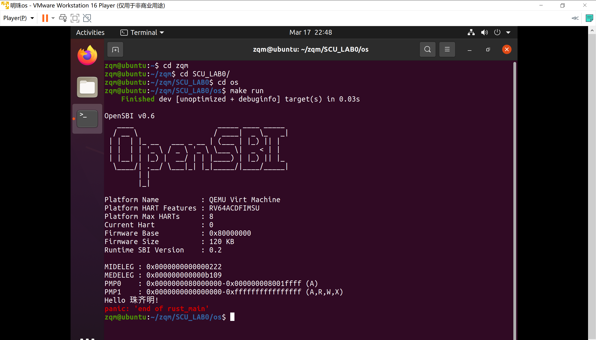
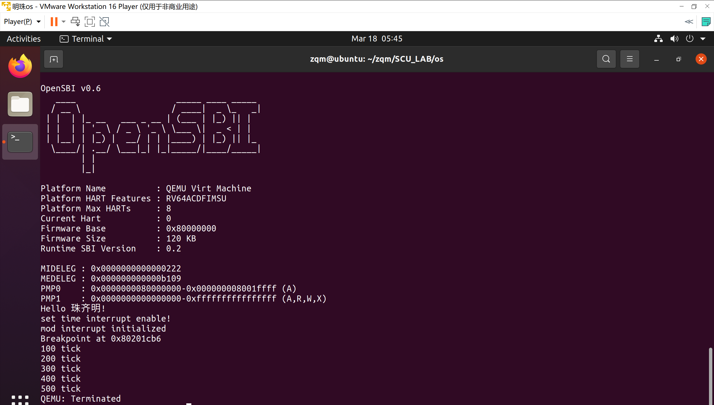
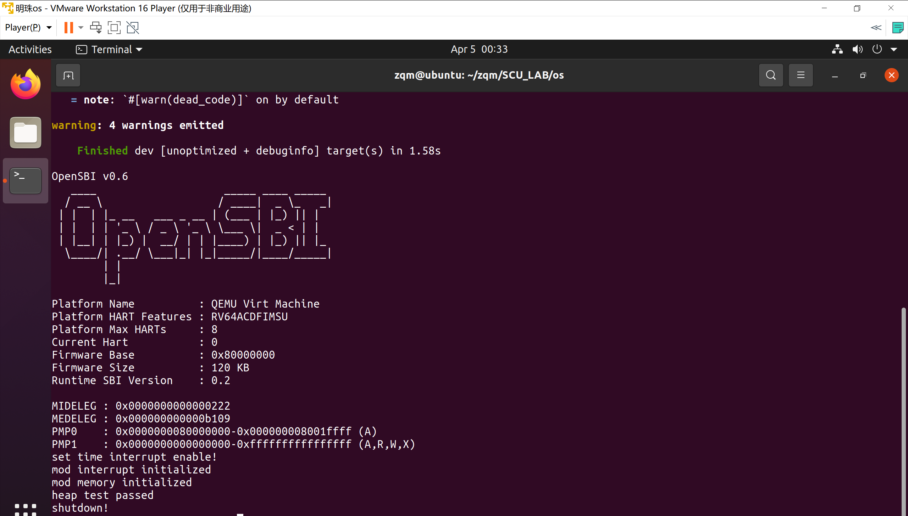
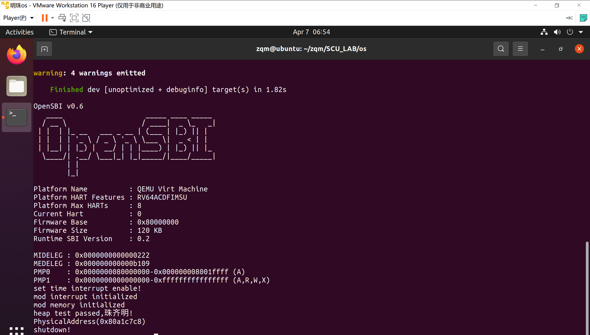
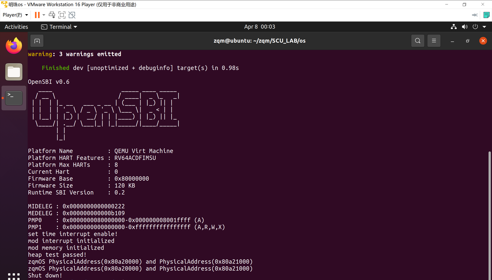
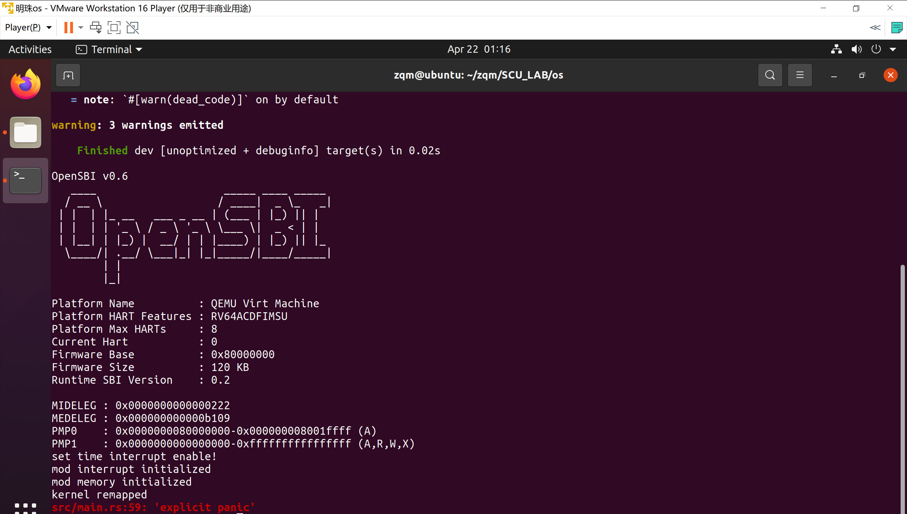

# SCUOS_LAB

四川大学操作系统原理课程实验

2019级计算机科学与技术 珠齐明

### 参考网址

https://rcore-os.github.io/rCore-Tutorial-deploy/

### 实验环境

VMware 虚拟机

qemu 5.0.0

rust nightly-2020-06-27

### 实验一  内核启动

### 实验二  中断

### 实验三  物理内存

##### 动态内存分配

##### 物理内存分配

##### 物理内存管理

### 实验四  页表实验

##### 实现页表

